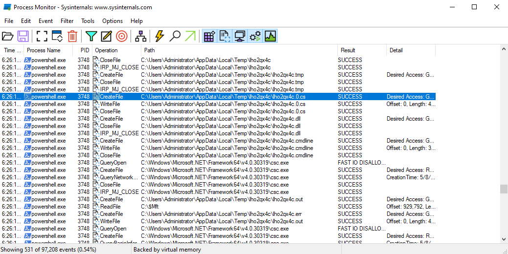
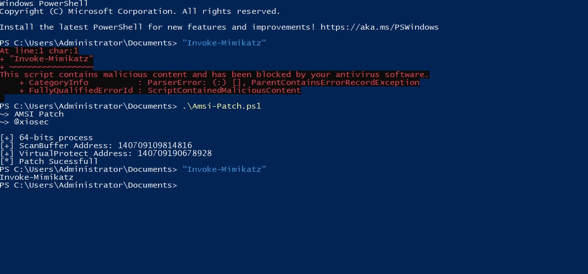

# AMSI Bypass

 

This repository contains techniques for [Antimalware Scan Interface (AMSI) bypass](https://xiosec.github.io/amsi-bypass).

> Certain techniques may have been altered or rewritten.

* [Patching AMSI AmsiScanBuffer](#patching-amsi-amsiscanbuffer)

## Patching AMSI AmsiScanBuffer
This technique prevents the buffer from being scanned by antiviruses by patching the AmsiScanBuffer function.

> Changes: Convert to `in memory` AMSI Bypass.

The problem was that other scripts used `Add-Type`. When Add-Type is used, the code is written to a `temporary file` and then `csc.exe `is used to compile a binary that stays on disk. This creates a problem when you want to remain furtive and don't want to write anything on the disk.

* [AMSI-Patch.ps1](AMSI-Patch.ps1)

* credit
    * [xpn](https://github.com/xpn)

## License

Released under [GPL-3.0](/LICENSE) by [@xiosec](https://github.com/xiosec).